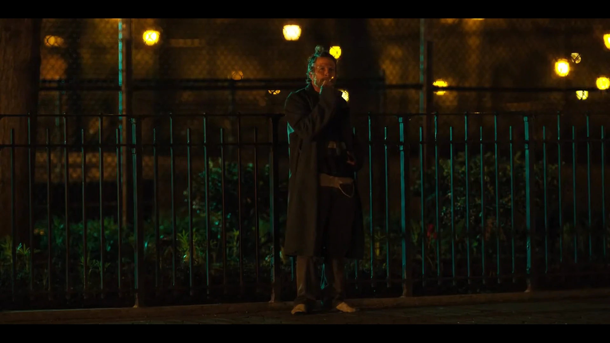
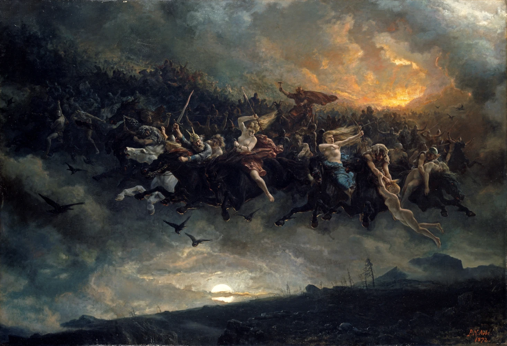
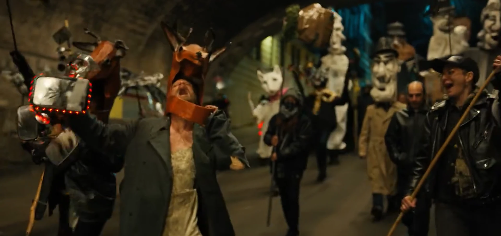

+++
date = '2025-01-04T15:40:10-05:00'
title = 'Horse, hevel, and healing'
+++

*This post is in progress and/or possibly abandoned.*

## Introduction

This essay hopes to establish the psychopompic fuction of Horse, the enigmatic homeless man in the 2019 Netflix series *Russian Doll*. This essay treats the first season as a self-contained standalone story.

### What Is a Psychopomp?

> **psychopomp** (*plural* **psychopomps**)
> 
> 1. (*religion*) A spirit, deity, person, etc., who guides the souls of the dead to the afterlife. (Wiktionary, 2024)

A psychopomp ferries the souls of the dead from this world to the next. The Egyptian Anubis, the Germanic Wotan/Woden/Odin, and our own Grim Reaper &mdash; death itself personified &mdash; fulfill this psychopompic function.

> Sigmund rose up, and sorrowed nigh to death over him; then he took the corpse in his arms and fared away to the wood, and went till he came to a certain firth; and there he saw a man in a little boat; and that man asked if he would be wafted by him over the firth, and he said yea thereto; but so little was the boat, that they might not all go in it at once, so the corpse was first laid therein, while Sigmund went by the firth-side. But therewith the boat and the man therein vanished away from before Sigmund's eyes. (Volsunga Saga, Ch. X)

Animals, too, may serve psychopompic functions. Odin was accompanied by two ravens, and, indeed, Germanic stories often set the scene for bloodshed by indicating the presence of hungry ravens and wolves on the soon-to-be battlefield, eagerly awaiting their next meal. This connection suggests that the above definition is perhaps too limited in scope. Carrion animals do not guide the souls of the dead, but rather guide the corpses of the dead in their transformation from useless, decaying matter. Psychopomps are functionally transformational.

> Vultures orient us toward death as material transformation in a way that cares little for its cause... The vulture is a species that the ancient Greeks identified as a psychopomp &mdash; an animal guide to the other side, a greeter at death's door, a harbinger of demise. (Gray, 2017)

If the vulture, raven, and wolf are psychopomps in the material sense, transforming dead *matter*, the function of the deity is *spiritual* transformation. Narratively this takes the form of a metaphysical journey. Charon ferries the soul across the River Styx. The Valkyrie carries the slain to Valhalla. But if we peek behind the metaphor, we can speculate that this spiritual transformation is one which prepares the soul for whatever comes next.

> Plato's dialogue, *Meno*, opens with this question by Meno: "Can you tell me Socrates &mdash; is virtue something that can be taught? Or does it come by practice? Or is it neither teaching nor practice that gives it to a man but natural aptitude or something else?"
> 
> ... Whatever else the question entails properly as a consideration, it is a question about *change*: Can one go from a condition of being unlearned to one of being taught?...
> 
> Let us use one of Plato's own examples from the *Republic*, the allegory of the cave... Those who have managed to be freed from their fetters ascertain by the act of turning around from the wall where the shadows play that there is a source or a cause of the shadows. They can give themselves an adequate account (*logos*) of what they had seen, that the world of appearances is what they had known, and that world is henceforth known in terms of something else. When they make their way up out of the cave, coming to the surface of earth they &mdash; by practice now &mdash; are able to recognize their own and other images reflected in water by the light of the Sun... But what have they been taught? And by whom have they been taught?...
> 
> The allegory, which I am so briefly sketching here does not end with the emergence upon the surface of earth of those hitherto bound. They go back down into the cave to show, or to teach or to invite into the practice they have learned, those who remain there bound. There is, then, a very important sense in which such "teachers" are a kind of "psychopomp" leading the fettered soul from darkness to light...
> 
> Plato's psychopomps (my term, not Plato's) in his allegory of the cave show others where they have been and how they got there, even though they themselves do not *know* fully how they got there or even, indeed, where they arrived. They invite others into an activity. They invite others into a functioning freely &mdash; functioning freely, albeit alongside a dialectic (dia-logic) that is a *partial* account of what is happening to them. (Cooper, 1978)

It is impossible to know, and pointless to speculate, how accurately the allegory of the cave applies to death, but the point remains that we can think of posthumous education as part of the role of the psychopomp. The psychopomp invites the deceased into the activity of death, whatever that may entail.

## *Russian Doll*

### S01E01

> The tale tells that great fires were made endlong the hall, and the great tree aforesaid stood midmost thereof; withal folk say that, whenas men sat by the fires in the evening, a certain man came into the hall unknown of aspect to all men; and suchlike array he had, that over him was a spotted cloak, and he was bare-foot, and had linen-breeches knit tight even unto the bone, and he had a sword in his hand as he went up to the Branstock, and a slouched hat upon his head: huge he was, and seeming-ancient, and one-eyed. (Volsunga Saga, Ch. III)

When we first meet Horse, Nadia is leaving her birthday party with Mike. She sees Horse across the street, leaning against a fence, asking passersby if they have a quarter. Mike sees her staring and asks, "Are you alright?" to which Nadia replies, "I think I know that guy."

Later interactions with Horse will establish that she does not, in fact, know that guy.

The camera turns back around to Horse who is getting a light from another passerby. He takes a long drag on his cigarette while he stands barefoot, staring directly at the camera.

> 
> (*Russian Doll*, S01E01)

Minutes later, Nadia sees her missing cat, steps into the street to retrieve him, is hit by a cab, and dies for the first time.

In the next loop, Nadia sees him again at the same intersection.

> NADIA: I think I know this guy. Hey! Do I know you?
>
> HORSE: What?
> 
> NADIA: Do we know each other?
>
> HORSE: Fuck off. (*Russian Doll*, S01E01)

We next see Horse in her next loop, playfully swinging on the fence. It is very cute.

Notice how Horse's physical appearance is strikingly similar to the Volsungasaga's description of Odin, the quintessential psychopomp of Northern Europe who harvests the souls of heroes and kings. He almost never appears in Midgard (earth, the mortal realm) except in the garb of a vagrant.

While I find it unlikely that Horse is *intended* to be Odin-like here, he serves a similar function: that of a vagrant who facilitates a spiritual transformation. While the traditional psychopomp transforms the spirit from one of life to one of death, Horse puts Nadia's soul on the path from brokenness to healing (and, depending on your interpretation of the series finale, this may be the same thing).

It is also possible that Horse is merely an example of "Wisdom from the Gutter": "You don't expect your average homeless person to want to talk, much less have a lesson they're prepared to teach you (that somehow specifically addresses your problem)" (TV Tropes).

### S01E02

> Vanity of vanities, saith the Preacher, vanity of vanities; all is vanity. (Ecclesiastes 1:2, KJV)

> Utter futility!—said Koheleth—  
Utter futility! All is futile! (Ecclesiastes 1:2, JPS, 1985)

"Vanity" is an interesting translation choice. The Hebrew word is "*hevel*", breath or vapor. *Hevel* is like a mist. You can see it, but when you reach out to grasp it your hand comes away empty. It is the illusion of substance, the promise of fulfillment. *Kohelet* laments that all is *hevel* because he has tried all things, virtue and vice alike, and found it all as impermanent as the morning fog.

As Nadia struggles to confront her (im)mortality, she throws herself fully into her birthday party. We see a montage of heavy drinking and drug use until Nadia passes out on the couch. *Hevel*, *hevel*! All is *hevel*!

### S01E03

Nadia is wandering drunk through the park.

> HORSE: What's on your head? I said, what's on your head? Is that a wig or a hat?
>
> NADIA: Where's your shoes, man?
>
> HORSE: Mmm, someone stole them last night at the shelter, so I'm not going back there, not ever. I don't sleep among thieves.
>
> NADIA: Man, someone stole your shoes? Hey, what the fuck is going on in America, huh? What's your name, do I know you?
>
> HORSE: No, you can call me Horse, if you want.
>
> NADIA: Alright, Horse, I'm Nadia. You want some?
>
> HORSE: Can I tell you something?
>
> NADIA: Yeah. Yeah, yeah. Yeah, yeah. I'm, mm, y'know, I wouldn't tell me anything, you know, if I was you, because I'm just not the kind of person that you tell secrets to. Uh, I'm the abyss.
>
> *They both laugh uproariously.*
>
> HORSE: I wanna cut your hair. (*Russian Doll*, S01E03)

Nadia immediately agrees. As Horse prepares his tools, Nadia jokes, "You're gonna kill me."

"I'm not."

"You can change your mind."

"Okay," Horse says, brandishing his scissors.

Cut to post-haircut. Horse holds up a tuft of severed hair.

> HORSE: You see this? This is the old you. This is who you were day after day after day. But it's gone now. 'Cause this, this is the new you. Now you can be whoever you wanna be. (*Russian Doll*, S01E03)

Nadia and Horse hunker down for the night and Nadia respawns in the bathroom having frozen to death. Nadia goes to the shelter to keep an eye on Horse's shoes. He warns her not to touch him while he sleeps because he's "got reflexes." Nadia prevents the theft. When Horse awakens the next morning he looks Nadia in the eye, announces that he wants to cut her hair, and trots out of the shelter without another word.

Horse helps Nadia literally shed her old self, her baggage and trauma. The futility of life, especially life in the loop, suddenly takes a backseat to this simple selfless act of protecting Horse's shoes.

### S01E04

Alan's approach to the time loop is to attempt to control every aspect of his day. When he meets Nadia, he learns that his control was an illusion. Confronted with his own powerlessness and the futility of his actions, he begins to fall apart, culminating with his breaking a mirror.

### S01E05

This episode is largely about Nadia failing to make amends with John by meeting Lucy and Alan failing to figure out why Beatrice cheated on him. None of it is terribly relevant to the current topic.

### S01E06

Nadia and Alan are at a bar. Alan notices Nadia's necklace.

> ALAN: That's pretty.
>
> NADIA: Oh, this, this was my mother's. It's a *krugerrand*. You know what that is?
>
> ALAN: May&mdash; No. No, I definitely don't.
>
> NADIA: It's a South African gold bullion. It goes for about, uh, $1,500 an ounce.
>
> ALAN: Whoa. Cool.
>
> NADIA: I told you my grandparents are Holocaust survivors, right?
>
> ALAN: No, we basically just met. I'm sorry about&mdash;
>
> NADIA: It's not on you. Anyway, after the war, you know, most survivors were a little bit paranoid about putting their money in banks, so my grandparents acquired 150 of these babies, and then my mother, 'cause shes a fucking piece of work, she spent them all except for this one.

Nadia steals Alan's shoes and takes them to the park.

> NADIA: Hey. Hey, Horse. Hey, man. Uh... Uh, Nadia. Yeah. It's me, I'm your friend. You gave me a haircut.
>
> HORSE: I don't know you.
>
> NADIA: All right, be cool, man. Look, look, look, what size are you?
> HORSE: What do you mean?
>
> *(NADIA holds up the shoes.)*
>
> HORSE: Come with me.
>
> NADIA: All right. Where the fuck are we going?
> 
> HORSE: I got plants.
>
> *(Cut to the two of them smoking and huffing glue)*
>
> HORSE: I prefer casual acquaintances over closer relations, and strangers above everybody else, 'cause humanity's a fuck, man. I had this business partner once in the 90s when we were creating the dark web, and he got arrested because it was a scam and our government is a scam, and once I saw it was all just bullshit I just dropped out completely.
>
> NADIA: How do you know that you're real?
> 
> HORSE: Huh?
>
> NADIA: Do you think that we need people to be, like, witnesses?
>
> HORSE: I'm here. That's where you know. I'm glad I lost everything. Technology, cryptocurrencies... It's all bullshit, man. You don't need any of that stuff. The more stuff you accumulate, the more space you take up. You know, people can't even pick me out of a lineup 'cause they don't remember me. I'm a shadow, man.
>
> NADIA: I think I'm a shadow now, too.
>
> *(NADIA gives HORSE her necklace)*
>
> HORSE: Is that real gold? Why?
> 
> NADIA: It's too heavy. (*Russian Doll*, S01E06)

Horse teaches Nadia that things are immaterial. Wealth and possessions are nothing. The person in front of you, that's what's real. And in response, she gives Horse the symbol of her resentment toward her mother. She sheds it as she did her hair three episodes ago.

### S01E07

### S01E08

> 
> (Arbo, 1872)

> 
> (*Russian Doll*, S01E08)

## References

Anonymous. (n.d.). *Völsunga Saga*. https://www.gutenberg.org/files/1152/1152-h/1152-h.htm#link2HCH0001

Arbo, P. N. (1872). *Åsgårdsreien (The Wild Hunt of Odin)*.

Cooper, R. M. (1978). *Psychopomps and Change-Agents, or Can Virtue Be Taught?* Theology Today, 35(3), 285–291. https://doi.org/10.1177/004057367803500305

Gray, J. M. (2017). *Vultures: Consumptions and Conjurings*. Rhetoric Society Quarterly, 47(3), 238–246. https://doi.org/10.1080/02773945.2017.1309907

Jewish Publication Society. (1985). Tanakh: Torah, Nevi’im, Kethuvim; the new translation of The Holy Scriptures according to the traditional Hebrew text. The Jewish Publication Society.

TV Tropes. (n.d.). Wisdom from the Gutter. TV Tropes. https://tvtropes.org/pmwiki/pmwiki.php/Main/WisdomFromTheGutter

Wiktionary. (2024). *Psychopomp*. https://en.wiktionary.org/wiki/psychopomp