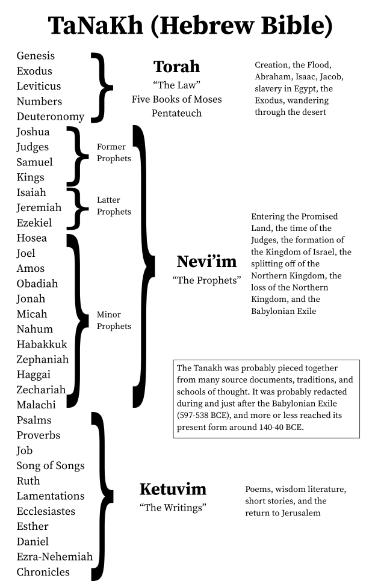
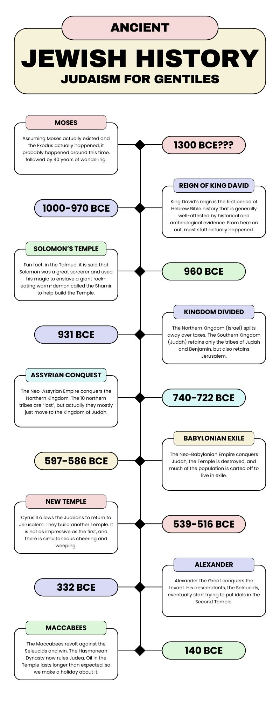
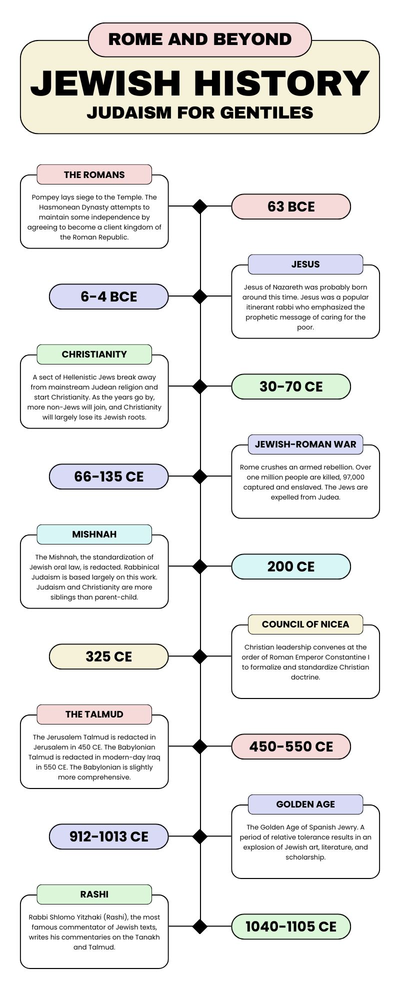

After hearing some feedback on the first lecture, I realized that I may have put the cart in the gift horse's mouth. In order to provide context for the topics discussed both previously and going forward, I've put together some visuals. One is a chart which explains the Tanakh, the order of its books, and how they are divided. Next is a couple of brief timelines which should help place events in relative context.

## Revision History

- 2025-08-06: Original posting.